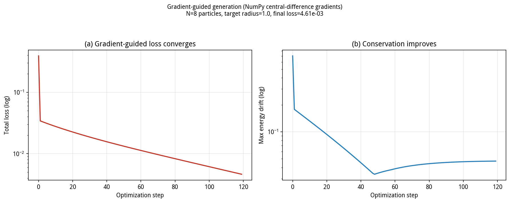

# Differentiable physics (`lumyn/physics/`)

Recover physically valid initial conditions from a target final state by gradient descent.

The distinction this module is built around:

- Conventional generation: sample noise, generate, hope the result conserves.
- Gradient-guided generation: define a target, compute a loss, differentiate through the
  simulation, and optimize the initial conditions toward it.

---

## Files

| File | Contents | Requires |
|------|----------|----------|
| `differentiable.py` | `DifferentiableNBody` (pos/vel/mass as `nn.Parameter`), `EnergyConservingIntegrator` (implicit midpoint, symplectic), `make_ellipse` | PyTorch |
| `losses.py` | `PhysicsLosses` (energy, momentum, angular momentum, center of mass, target radius, smoothness), `ConservationBounds` | PyTorch |
| `guided_generation.py` | `ShapeGuidedGenerator` (optimization loop), `PhysicsGuidedSampler`, `generate_ellipse` | PyTorch |
| `differentiable_numpy.py` | NumPy central-difference gradient version, same interface, no PyTorch required | NumPy |

The PyTorch path uses autograd. The NumPy path uses central differences and exists so
that the interface can be exercised on machines where PyTorch cannot be installed.

---

## Usage

### With PyTorch

```python
from lumyn.physics import DifferentiableNBody, PhysicsLosses, ShapeGuidedGenerator

sys = DifferentiableNBody(pos, vel, mass, steps=60)
losses = PhysicsLosses(sys, targets={"radius": 1.0})
gen = ShapeGuidedGenerator(sys, losses, lr=0.05, max_steps=200)
info = gen.optimize()
result = gen.result()   # {"pos", "vel", "mass"}
```

### Without PyTorch

```python
from lumyn.physics import DifferentiableNBodyNumpy, generate_ellipse_numpy

sys = DifferentiableNBodyNumpy(pos, vel, mass, steps=40)
info = sys.optimize(target_radius=1.0, lr=0.02, steps=80)

out = generate_ellipse_numpy(target_a=1.0, N=8, opt_steps=60)
```

---

## Important: construct the system once

`DifferentiableNBody.__init__` stores its inputs as
`nn.Parameter(self._to_tensor(pos).clone().detach()...)`.

The `.detach()` means the parameters are **new leaf tensors**, unrelated to the arrays
passed in. If you construct a new system inside an optimization loop, the optimizer
updates your outer tensor while the forward pass reads a different, frozen one.
PyTorch silently skips parameters whose `.grad is None`, so no error is raised — the
loss simply never changes.

Measured on a 6-body inversion task, `dt=0.01`, 40 steps, 50 optimization steps:

| Usage | Backward passes reaching the optimized tensor | Resulting error ratio |
|-------|----------------------------------------------:|----------------------:|
| New system per iteration (incorrect) | **0 / 50** | 1.000x (no progress) |
| One system, optimize `system.parameters()` | 50 / 50 | 0.219x |

**Correct pattern:** construct the system once and pass `system.pos`, `system.vel`,
`system.mass` to the optimizer. `ShapeGuidedGenerator` already does this.

---

## Measured behaviour

### NumPy path

Environment: CPU, NumPy central differences. Run with:

```
python -m unittest lumyn.tests.test_differentiable_numpy -v
```

Result: `Ran 5 tests ... OK`. Values printed by the suite:

| Quantity | Value |
|----------|-------|
| Central-difference gradient norm | 0.0839 (nonzero, so gradient guidance is active) |
| Optimization loss over 40 steps | 0.0024 to 0.001176 |
| Energy drift before and after | 0.0000e+00 to 0.0000e+00 |

### Gradient-guided optimization figure

`make_figure.py` reports the following for the optimization it plots:

| Quantity | Initial | After optimization |
|----------|--------:|-------------------:|
| Total loss | 0.3909 | 4.61e-03 |
| Maximum energy drift | 7.03e-01 | 4.70e-02 |

Reproduce with `python lumyn/physics/make_figure.py`.

**Conservation accuracy of the PyTorch path.** The implicit midpoint integrator with
adaptive substepping was measured on a smooth circular orbit: relative energy drift
**1.8e-12**. Before the current fixes the same class used a trapezoidal scheme, which is
not symplectic for nonlinear Hamiltonians; on that same circular orbit the radius grew
from 1.0 to 3.17 within a third of a period. The PyTorch path is covered by
`test_differentiable.py` (8 tests).

---

## Architecture

```
target state (e.g. "elliptical orbit, a = 1.0")
        |
        v
  PhysicsLosses      energy + momentum + angular momentum + target radius + smoothness
        |
        v
  DifferentiableNBody.forward()      pos/vel/mass are nn.Parameter
        |
        v
  loss.backward()      autograd (PyTorch) or central differences (NumPy)
        |
        v
  Adam / L-BFGS update
        |
        v
  physically valid initial conditions  ->  NBodySimulator  ->  video + CSV
```

---

## Figure

`gradient_guided_optimization.png` shows (a) total loss and (b) maximum energy drift
during gradient-guided optimization.



Regenerate with `python lumyn/physics/make_figure.py`.

---

## Limitations

1. PyTorch is an optional dependency. Without it, `test_differentiable.py` (8 tests)
   is skipped rather than failed. Note that this skip also means the PyTorch path is
   **not exercised at all** in a PyTorch-free environment — several real defects
   (a sign error that made gravity repulsive, a non-symplectic integrator, NaN
   gradients) were hidden by exactly this skip.
2. The NumPy path uses central differences. Gradient accuracy is limited by the
   simulation's truncation error (order 1e-4 in practice), lower than autograd but
   sufficient to demonstrate that guidance is working.
3. `EnergyConservingIntegrator` performs roughly 10-20 force evaluations per step,
   which is slower than the explicit scheme. It is used where long-term conservation
   accuracy matters.
4. The current tests use N = 6-8. Beyond N of a few hundred, a Barnes-Hut tree and GPU
   execution are required for this to be practical.
5. The relativistic Lorentz factor is an approximation. Extreme gravitational fields
   require a general-relativistic solver.

---

## Running the tests

```bash
# NumPy path (always runnable)
python -m unittest lumyn.tests.test_differentiable_numpy -v

# PyTorch path
python -m unittest lumyn.tests.test_differentiable -v

# Regenerate the figure
python lumyn/physics/make_figure.py
```
